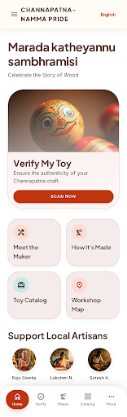
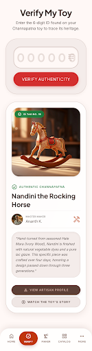

# Channapatna Namma Pride 🎨🧸

[](https://github.com/guruprasadsa/Channapatna-NammaPride/actions/workflows/android.yml)
[](https://github.com/guruprasadsa/Channapatna-NammaPride/releases/latest)

**Channapatna Namma Pride** is a premium Android application dedicated to preserving the cultural heritage of Channapatna toys. It provides a secure platform for verifying Geographical Indication (GI) tagged toys and connecting consumers with the master artisans behind the craft.

## ✨ Key Features

- **🔍 Heritage Verification**: Instantly verify the authenticity of Channapatna toys using unique tracking IDs linked to a secure Firestore backend.
- **🛠️ Meet the Maker**: Detailed artisan profiles showcasing their stories, techniques, and cultural impact.
- **📍 Interactive Workshop Map**: Navigate the streets of Channapatna to visit authentic artisan clusters and workshops via Google Maps integration.
- **🌺 Premium Heritage UI**: A high-fidelity interface built with Jetpack Compose, featuring a bespoke color palette (Bone Surface, Lacquer Red, Wood Brown) that mirrors the traditional lacquerware aesthetic.
- **🌍 Full Kannada Localization**: Culturally native experience for local communities and tourists alike.

## 🚀 Technical Architecture

- **UI Framework**: Jetpack Compose (Material 3)
- **Architecture**: Clean MVVM (Model-View-ViewModel) with StateFlow
- **Backend**: Firebase Firestore (NoSQL)
- **Navigation**: Compose Navigation
- **Image Loading**: Coil
- **Maps**: Google Maps Compose SDK

## 🛠️ Installation & Setup

1. **Clone the Repository**:
   ```bash
   git clone https://github.com/guruprasadsa/Channapatna-NammaPride.git
   ```
2. **Firebase Setup**:
   - Create a Firebase project and add an Android app.
   - Download `google-services.json` and place it in the `app/` directory.
   - Enable Cloud Firestore and seed the data using the provided scripts in `/scripts`.
3. **Maps API**:
   - Obtain a Google Maps API Key from the Google Cloud Console.
   - Add the key to your `local.properties`:
     ```properties
     MAPS_API_KEY=your_api_key_here
     ```
4. **Build & Run**:
   - Open in Android Studio (Koala or later).
   - Sync Gradle and run on an emulator or physical device.

## 📸 Screenshots

| Home Screen | Toy Verification | Artisan Profile |
| :---: | :---: | :---: |
|  |  |  |

## 📜 License

This project is licensed under the MIT License. It is intended for cultural preservation and community empowerment.

---
Developed with ❤️ for the artisans of Channapatna.
