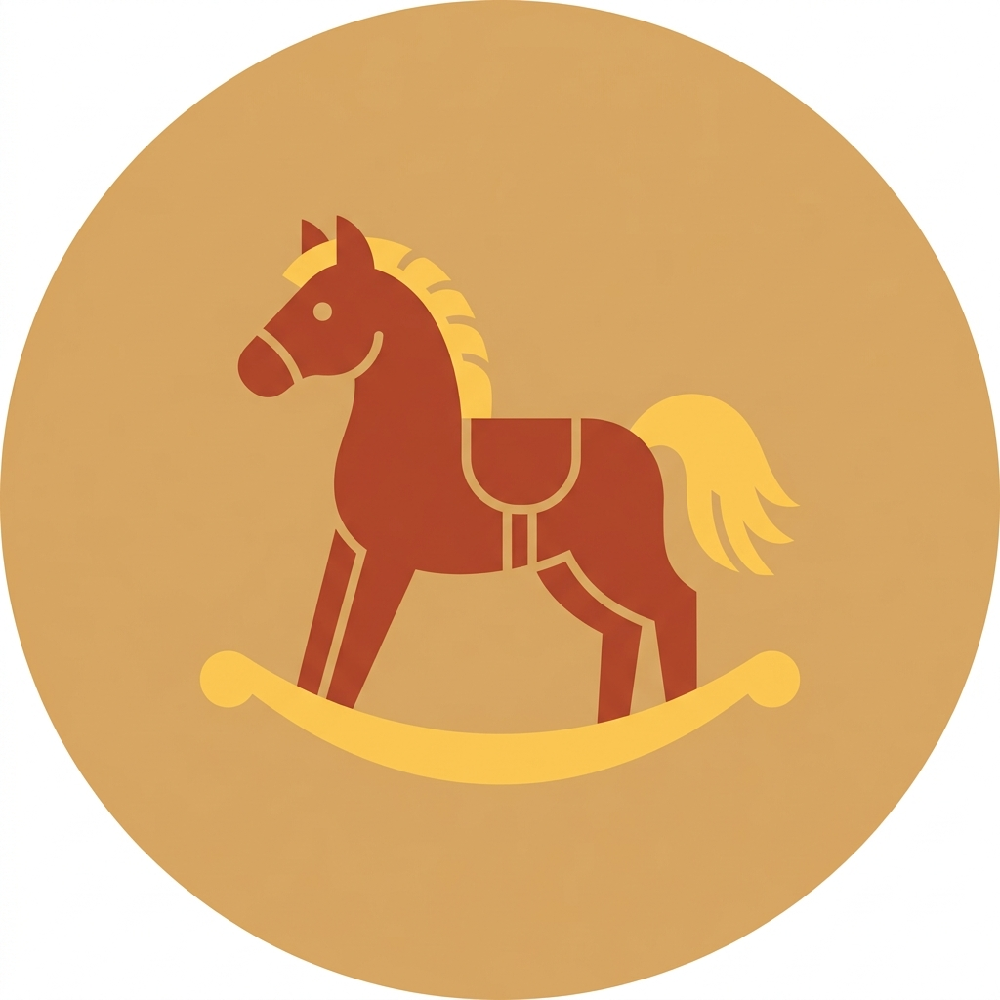

<p align="center">
  
</p>

<h1 align="center">Channapatna Namma Pride</h1>

<p align="center">
  <em>Preserving a 200-Year-Old Craft, One Tap at a Time.</em>
</p>

<p align="center">
  <a href="https://github.com/guruprasadsa/Channapatna-NammaPride/actions/workflows/android.yml"></a>
  <a href="https://github.com/guruprasadsa/Channapatna-NammaPride/releases/latest"></a>
  
  
  
</p>

---

## 📌 Problem Statement

Channapatna, a small town in the Ramanagara district of Karnataka, India, has been the heart of traditional wooden lacquerware toy-making for over **200 years**. This craft was awarded the prestigious **Geographical Indication (GI) tag** (GI No. 75) in 2005, recognizing it as a unique cultural treasure of the region.

However, the craft and its artisans face critical, interconnected challenges:

- **Counterfeiting & Lack of Authenticity**: The market is flooded with mass-produced imitations that are falsely sold as authentic Channapatna products. Consumers have no reliable way to verify if a product is genuinely GI-tagged, undermining buyer trust and devaluing the original craft.
- **Artisan Invisibility**: The master craftsmen and craftswomen behind these toys remain anonymous. Their decades of skill, their family legacies, and their individual stories are completely invisible to the end consumer. The artisan is disconnected from the market.
- **Declining Footfall & Discovery**: While Channapatna is only 60 km from Bangalore, tourists and buyers struggle to discover authentic workshops. There is no centralized, accessible guide to navigate the town's artisan clusters, leading to missed cultural and economic opportunities.
- **Language & Cultural Barriers**: Existing digital resources, if any, are predominantly in English, alienating the local Kannada-speaking community and creating a disconnect between the craft's cultural roots and its digital presence.

**Channapatna Namma Pride** directly addresses each of these challenges by providing a unified digital platform that serves as a verification tool, an artisan directory, and a cultural guide.

---

## ✨ Key Features

| Feature | Description |
| :--- | :--- |
| 🔍 **Heritage Verification** | Instantly verify the authenticity of any Channapatna toy by entering its unique GI Tag number against a secure Firestore backend. |
| 🛠️ **Meet the Maker** | Explore rich, detailed profiles of 7+ master artisans — their stories, specialties, years of experience, and contact information. |
| 📍 **Interactive Workshop Map** | Discover and navigate to authentic artisan workshops across Channapatna with integrated Google Maps and turn-by-turn directions. |
| 🌺 **Premium Heritage UI** | A high-fidelity interface with a bespoke color palette (Bone Surface, Lacquer Red, Wood Brown) that mirrors the traditional lacquerware aesthetic. |
| 🌍 **Full Kannada Localization** | Seamless bilingual support (English ↔ ಕನ್ನಡ) with culturally native translations for the local community. |

---

## 📸 Screenshots

| Home Screen | Toy Verification | Artisan Profile |
| :---: | :---: | :---: |
|  |  |  |

---

## 🏗️ Technical Architecture

```
┌─────────────────────────────────────────────────┐
│                  Presentation Layer              │
│         Jetpack Compose (Material 3 UI)          │
│       Navigation · Coil · Google Maps SDK        │
├─────────────────────────────────────────────────┤
│                  ViewModel Layer                 │
│            MVVM · Kotlin StateFlow               │
│          Business Logic & State Mgmt             │
├─────────────────────────────────────────────────┤
│                   Data Layer                     │
│           Firebase Firestore (NoSQL)             │
│         Artisans · Toys · Workshops              │
└─────────────────────────────────────────────────┘
```

### Tech Stack

| Component | Technology |
| :--- | :--- |
| **Language** | Kotlin |
| **UI Framework** | Jetpack Compose (Material 3) |
| **Architecture** | Clean MVVM with StateFlow |
| **Backend** | Firebase Cloud Firestore |
| **Navigation** | Compose Navigation |
| **Image Loading** | Coil |
| **Maps** | Google Maps Compose SDK |
| **Localization** | Android Resource System (`values/`, `values-kn/`) |
| **CI/CD** | GitHub Actions |

---

## 🛠️ Installation & Setup

### Prerequisites
- Android Studio **Koala** (2024.1.1) or later
- JDK 17+
- A Firebase project with Firestore enabled
- A Google Maps API Key

### Steps

1.  **Clone the Repository**
    ```bash
    git clone https://github.com/guruprasadsa/Channapatna-NammaPride.git
    cd Channapatna-NammaPride
    ```

2.  **Firebase Configuration**
    - Create a new project in the [Firebase Console](https://console.firebase.google.com/).
    - Register an Android app with package name `com.guruprasad.channapatnanammapride`.
    - Download the `google-services.json` file and place it in the `app/` directory.
    - Enable **Cloud Firestore** in the Firebase Console.

3.  **Seed the Database**
    ```bash
    cd scripts
    npm install firebase-admin
    export GOOGLE_APPLICATION_CREDENTIALS="/path/to/your/serviceAccountKey.json"
    node seed_firestore.js
    ```

4.  **Configure Google Maps**
    - Obtain an API Key from the [Google Cloud Console](https://console.cloud.google.com/).
    - Add the key to your `local.properties`:
      ```properties
      MAPS_API_KEY=your_api_key_here
      ```

5.  **Build & Run**
    - Open the project in Android Studio.
    - Sync Gradle dependencies.
    - Run on an emulator (API 24+) or a physical device.

---

## 📁 Project Structure

```
ChannapatnaNammaPride/
├── app/
│   └── src/main/
│       ├── java/.../          # Kotlin source (MVVM)
│       ├── res/
│       │   ├── values/        # English strings & themes
│       │   └── values-kn/     # Kannada strings
│       └── AndroidManifest.xml
├── scripts/
│   └── seed_firestore.js      # Firestore data seeding script
├── metadata/
│   └── screenshots/           # App screenshots for store listing
├── firestore.rules            # Firestore security rules
├── firestore.indexes.json     # Firestore composite indexes
├── firebase.json              # Firebase project configuration
├── PRD.md                     # Product Requirements Document
└── README.md                  # You are here
```

---

## 🤝 Contributing

Contributions are welcome! If you'd like to help preserve this heritage through code:

1.  Fork the repository.
2.  Create a feature branch (`git checkout -b feature/amazing-feature`).
3.  Commit your changes (`git commit -m 'Add amazing feature'`).
4.  Push to the branch (`git push origin feature/amazing-feature`).
5.  Open a Pull Request.

---

## 📜 License

This project is licensed under the **MIT License**. It is intended for cultural preservation and community empowerment.

---

<p align="center">
  Developed with ❤️ for the artisans of Channapatna, Karnataka.
</p>
